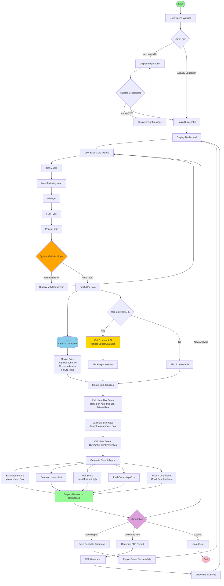

# CarTrust – Used Car Intelligence Platform
## System Flowchart

## Flowchart Legend

- **Start/End** (Oval): Process start and end points
- **Process Blocks** (Rectangle): Actions and operations
- **Decision Blocks** (Diamond): Conditional logic and validation
- **Database** (Cylinder): Data storage operations
- **API Block** (Hexagon): External API interactions
- **Arrows**: Data flow direction

## System Components

### 1. Authentication Flow
- User login validation
- Session management
- Error handling for invalid credentials

### 2. Data Input & Validation
- Car Model (text input)
- Manufacturing Year (numeric, range validation)
- Mileage (numeric, positive validation)
- Fuel Type (dropdown: Petrol/Diesel/Electric/Hybrid)
- Price (numeric, positive validation)

### 3. Data Fetching
- **Internal Database**: Stores historical data, market prices, maintenance records, common issues, failure rates
- **External API** (Optional): Vehicle specifications, current market valuation, additional reliability data

### 4. Calculations
- **Risk Score Algorithm**: 
  - Age factor (older = higher risk)
  - Mileage factor (higher = higher risk)
  - Failure rate from database
  - Output: Low (0-40), Medium (41-70), High (71-100)
  
- **Annual Maintenance Cost**:
  - Base maintenance cost from database
  - Adjusted for age and mileage
  - Fuel type multiplier
  
- **5-Year Ownership Cost**:
  - Purchase price
  - 5 × Annual maintenance
  - Estimated repairs (based on failure rate)
  - Depreciation factor

### 5. Price Comparison
- Compare entered price with market price from database
- Calculate value score
- Determine if it's a "Good Deal", "Fair Price", or "Overpriced"

### 6. Output Generation
- Visual dashboard with charts and metrics
- Detailed report with all calculations
- PDF export functionality
- Save report for future reference
